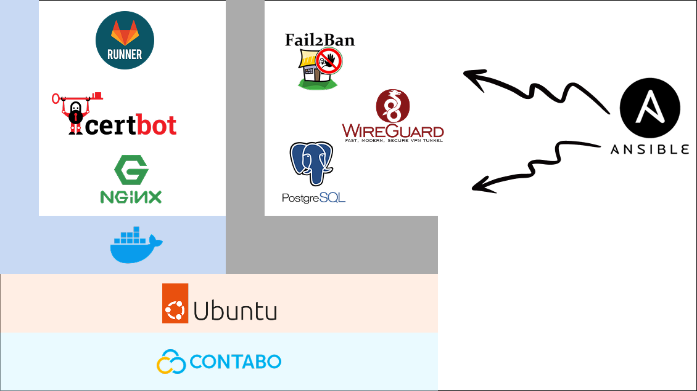

# Infrastructure Automation Lab using **Ansible** and **Docker**

This project demonstrates how to automate provisioning and management of infrastructure using **Ansible** and **Docker**.  
It’s designed as a hands-on home lab to explore DevOps, networking, and security practices, including VPNs, firewalls, CI/CD pipelines, and automated TLS management.

## Architecture Evolution

This lab is a **work in progress** and the architecture evolves as I explore new tools, practices, and designs.  
The diagram below represents the current state of the lab:



## Features
- Automated provisioning with **Ansible**
- Secure connectivity with **WireGuard VPN**
- Firewall configuration via **nftables**
- Containerized services managed by **Docker Compose**
- **Nginx reverse proxy** with automatic TLS certificates (Let’s Encrypt / Certbot ACME)
- **GitLab Runner** deployment and registration
- **SSH hardening** (disable root login, enforce key-based auth, customizable settings)
- Inventory-driven configuration with **Ansible Vault** support for secrets

## Requirements
- **Ansible** (>= 2.12)
- SSH access and sudo/root privileges on managed hosts
- DNS records pointing to proxy host for TLS validation
- GitLab instance or [gitlab.com](https://gitlab.com) with a registration token

Optional:
- **Ansible Vault** for managing sensitive values (tokens, keys, certs)

## Usage
1. Define your hosts in `inventory/hosts.yaml`
2. Configure variables in `group_vars/` and `host_vars/`
3. Run the bootstrap and setup playbooks:
   ```bash
   ansible-playbook -i inventory/hosts.yaml setup.yaml
