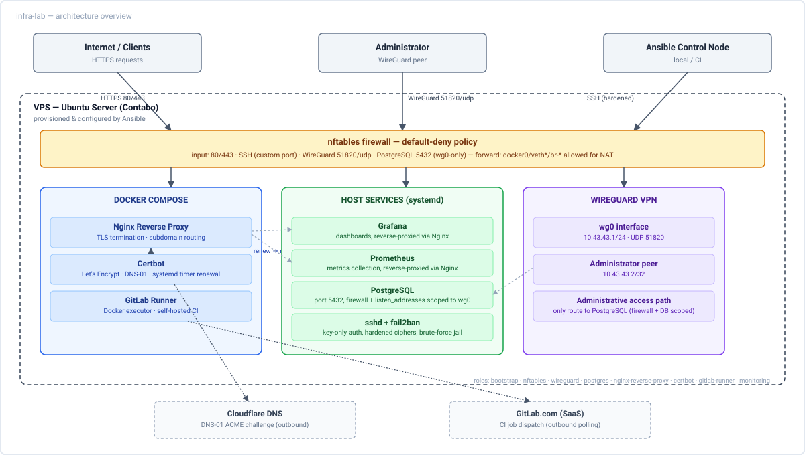

# infra-lab — Production-Style Linux Infrastructure Automation

Ansible-driven provisioning of a hardened Linux VPS: a Dockerized reverse proxy with automated TLS, a WireGuard-gated administration network, a default-deny nftables firewall, systemd-managed monitoring, and a self-hosted GitLab CI runner.

Built and iterated on against a real internet-facing VPS, not a tutorial sandbox — every role here was written, broken, debugged, and fixed under real conditions. This is a personal lab, not a production platform, but it follows the same practices used to run one: infrastructure as code, layered network security, automated certificate lifecycle management, and defense-in-depth applied to a real service (PostgreSQL). Altogether the project covers Linux provisioning and hardening, configuration management, network security, container orchestration, TLS automation, monitoring, and the infrastructure troubleshooting that comes with running all of it against a live host.

## Architecture



- **Public path:** Internet → nftables → Nginx (TLS termination, subdomain routing) → Grafana / Prometheus / static site.
- **Admin path:** Administrator → WireGuard tunnel (`10.43.43.0/24`) → PostgreSQL and other internal endpoints — gated at the firewall *and* at the database itself.
- **Control path:** Ansible, over hardened SSH, provisions and re-converges every role idempotently.

## What was built

One Ansible playbook (`setup.yaml`) takes a bare Ubuntu VPS to this stack, role by role:

| Role | Responsibility |
|---|---|
| `bootstrap` | SSH hardening, fail2ban, sysctl (IP forwarding), hostname |
| `nftables` | Default-deny firewall — input, forward, and NAT/postrouting chains |
| `wireguard` | Point-to-point VPN for administrative and database access |
| `postgres` | PostgreSQL, scoped to listen and accept connections only over WireGuard |
| `nginx-reverse-proxy` | Dockerized reverse proxy, TLS termination, subdomain routing |
| `certbot` | Wildcard Let's Encrypt certificates via DNS-01, automated renewal |
| `gitlab-runner` | Self-hosted, Docker-executor GitLab CI runner |
| `monitoring` | Prometheus + Grafana, installed as systemd services |

Each role is self-contained (its own `tasks/`, `handlers/`, `vars/`), so any one of them can be applied, reasoned about, or fixed without touching the rest of the stack — which is how the fixes below were made.

## Security architecture

- **SSH hardening** — key-only auth (`PermitRootLogin prohibit-password`), password and keyboard-interactive auth disabled, non-default port, restricted cipher/KEX/MAC suites, `AllowTcpForwarding no`.
- **WireGuard** — a private `10.43.43.0/24` tunnel is the only path to administrative and database access; nothing behind it has a public listener.
- **nftables** — `input` chain allows only SSH (custom port), 80/443, and WireGuard's UDP port by default; every other packet falls through to a terminal `drop`. PostgreSQL's port is explicitly scoped to `iifname "wg0" ip saddr 10.43.43.0/24` — it does not match on the public interface at all.
- **PostgreSQL — defense-in-depth, not a single control:** the firewall rule above is one layer; the database enforces the same boundary independently — `listen_addresses` binds only to `localhost` and the WireGuard tunnel address, and `pg_hba.conf` only accepts authenticated (`scram-sha-256`) connections from `10.43.43.0/24`. A misconfiguration in either layer alone does not expose the database.
- **Docker networking** — the firewall's `forward` chain defaults to `policy drop`, with explicit allowances for the interfaces Docker itself manages (`docker0`, `veth*`, `br-*`) so container NAT keeps working without weakening the default-deny posture (see troubleshooting #1).
- **TLS** — wildcard certificates via Let's Encrypt DNS-01 (Cloudflare), renewed on a systemd timer with automatic reverse-proxy reload.
- **Brute-force protection** — fail2ban jailing sshd: 3 attempts, 1-hour ban.
- **Secrets** — Ansible Vault for inventory secrets and the Cloudflare API token; plaintext credential files, WireGuard client keys, and the vault password are gitignored and never entered git history.

## Automation

```bash
ansible-playbook -i inventory/hosts setup.yaml
```

- Idempotent, role-based — re-running the playbook converges state instead of duplicating it.
- Handlers restart only what changed (e.g. `nftables` reloads only when the ruleset template changes).
- Certificate renewal runs outside Ansible's cycle, on a systemd timer (`certbot-renew.timer`, monthly) — infrastructure that stays correct between playbook runs, not just at provisioning time.

## Monitoring

Prometheus and Grafana run as native systemd services (not containerized), exposed through the same Nginx reverse proxy as public-facing services, each on its own TLS-terminated subdomain — metrics infrastructure decoupled from the containers it observes. Scrape targets and dashboards are currently configured manually post-install rather than templated by Ansible (see [Future improvements](#future-improvements)).

## Troubleshooting / engineering decisions

Real problems hit while operating this stack, not staged examples.

**1. Docker containers lost network connectivity after locking down the firewall**
- **Problem:** the initial default-deny `forward` chain silently broke outbound Docker networking.
- **Investigation:** Docker manages its own netfilter rules for bridge networking (`docker0`, per-container `veth*`, `br-*`); `flush ruleset` plus a strict `policy drop` wiped what Docker relies on for container NAT.
- **Solution:** explicitly accept forwarded traffic on Docker-managed interfaces while keeping default-deny for everything else (`nftables/files/input.j2`).
- **Result:** containers regained connectivity without weakening the firewall's default posture.

**2. Certificate renewal succeeded but Nginx kept serving the old certificate**
- **Problem:** certbot rotated the cert on disk; the public site still served the expired one.
- **Investigation:** the renewal hook's `reverse_proxy` variable pointed at container name `nginx`, but the actual container is `nginx-proxy` — combined with a `docker compose restart` invoked from a directory with no compose project context, the restart silently did nothing.
- **Solution:** corrected the container reference and restart command (`certbot/templates/renew.sh.j2`, `certbot/vars/main.yaml`).
- **Result:** a working renewal now measurably reloads the proxy — "the job exited 0" and "the job had the intended effect" turned out to be two different checks.

**3. Needed a wildcard certificate without exposing port 80**
- **Problem:** HTTP-01 validation requires port 80 reachability per hostname and doesn't support wildcards.
- **Investigation:** compared HTTP-01 against DNS-01 for `*.infra-lab.space`.
- **Solution:** Certbot's Cloudflare DNS plugin performs the DNS-01 challenge via the Cloudflare API — no inbound validation traffic required.
- **Result:** one wildcard certificate covers every subdomain with no additional exposed surface.

**4. A firewall rule that was correct in spirit but too broad in practice**
- **Problem:** a security self-review of `nftables/files/input.j2` found `tcp dport 5432 counter accept` with no interface restriction — PostgreSQL's port matched on every interface, not just WireGuard.
- **Investigation:** PostgreSQL itself still defaulted to `listen_addresses = 'localhost'`, so the exposure was latent, not active — but the firewall wasn't actually enforcing the intended boundary, and nothing said so at the database layer either.
- **Solution:** scoped the firewall rule to `iifname "wg0" ip saddr 10.43.43.0/24`, and independently set `listen_addresses` and added a `pg_hba.conf` entry on the database.
- **Result:** two independent layers now enforce the same boundary — the defense-in-depth control described above.

## Technologies

Ansible · Docker / Docker Compose · nftables · WireGuard · Nginx · Certbot / Let's Encrypt (DNS-01) · Prometheus · Grafana · GitLab Runner · PostgreSQL · fail2ban · systemd · Ansible Vault · Ubuntu Server

## Repository structure

```
inventory/            Host inventory, group_vars, Vault-encrypted secrets
bootstrap/            SSH hardening, fail2ban, sysctl, hostname
nftables/             Firewall ruleset (input / forward / postrouting) and reload handler
wireguard/            VPN interface config for server and client
postgres/             PostgreSQL install, listen/pg_hba scoped to the WireGuard subnet
nginx-reverse-proxy/  Dockerized reverse proxy, TLS vhost config, subdomain routing
certbot/              Wildcard cert issuance (DNS-01), systemd timer-driven renewal
gitlab-runner/        Self-hosted GitLab Runner (Docker executor)
monitoring/           Prometheus + Grafana (systemd services)
setup.yaml            Playbook entry point — applies all roles in order
ansible.cfg           Ansible defaults (inventory path, SSH key, remote user)
.gitlab-ci.yml        Smoke-test pipeline used to validate the self-hosted runner
images/               Architecture diagram
```

## Deployment / usage

Requirements: Ansible ≥ 2.12, SSH/root access to the target host, a DNS zone managed by Cloudflare (DNS-01), Ansible Vault for secrets.

```bash
# 1. Define the target host
vi inventory/hosts

# 2. Provide secrets (Vault-encrypted)
ansible-vault edit inventory/group_vars/main/vault.yaml
ansible-vault edit certbot/vars/cloudflare.ini.enc

# 3. Run the playbook
ansible-playbook -i inventory/hosts setup.yaml --ask-vault-pass
```

## Future improvements

- **Boot-order hardening:** add explicit systemd dependency ordering to guarantee WireGuard is available before PostgreSQL starts after reboot. Role order within a single Ansible run is already correct; this closes the gap for a cold reboot.
- Consolidate the WireGuard subnet value — currently defined independently in `wireguard/files/server/wg0.conf.j2` and `postgres/vars/main.yml` — into a single shared variable.
- Template Prometheus scrape configs and Grafana provisioning (dashboards/data sources) through Ansible instead of manual post-install setup.
- Add a CI lint/check stage (`ansible-lint`, `--syntax-check`); run locally today, it surfaces mostly pre-existing style debt, not functional issues.
